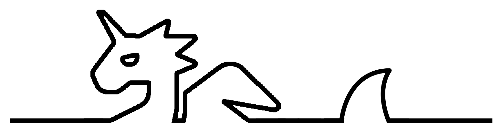
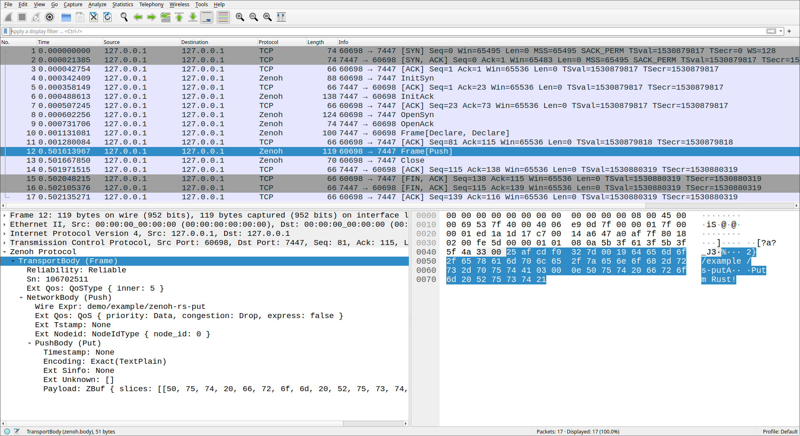

# Zenoh Dissector in Rust!

[Zenoh](http://zenoh.io/) protocol dissector for Wireshark.


> :warning: For dissecting zenoh protocol of version older than 0.10.0, please check the lua plugin [here(TBA)](TBA).

## Installation

### Prerequsites

1. [Rust](https://rustup.rs) toolchain.
2. [Wireshark](https://www.wireshark.org/download.html) application.

### Install dependencies

- Linux (Ubuntu)
    ```bash
    sudo apt-get install -y libglib2.0-dev libgcrypt-dev libc-ares-dev flex bison libspeexdsp-dev
    ```

- macOS

    Please install [Homebrew](https://brew.sh/) first.
    ```bash
    brew install libgcrypt c-ares speexdsp
    ```

- Windows

    Please install [Chocolatey](https://docs.chocolatey.org/en-us/choco/setup#install-with-powershell.exe) first.
    ```bash
    choco install -y --force --no-progress asciidoctorj xsltproc docbook-bundle nsis winflexbison3 cmake
    set WIRESHARK_BASE_DIR=C:\Development
    ```

### Build the plugin

```bash
cargo build --release
```

### Place the plugin properly

- Linux (Ubuntu)
    ```bash
    mkdir -p ~/.local/lib/wireshark/plugins/4.0/epan
    cp ./target/release/libzenoh_dissector.so ~/.local/lib/wireshark/plugins/4.0/epan/libzenoh_dissector.so
    ```

- macOS

    Assuming users have Wireshark application installed under _/Applications/Wireshark.app_.
    ```bash
    cp ./target/release/libzenoh_dissector.dylib /Applications/Wireshark.app/Contents/PlugIns/wireshark/4-0/epan/libzenoh_dissector.so
    ```

- Windows

    Usually is under _%APPDATA%\Wireshark\plugins_


## Usage

Take the pub/sub as a example. Please check [here](https://github.com/eclipse-zenoh/zenoh#how-to-build-it) for the building instructions.



## License

This program is free software: you can redistribute it and/or modify it under the terms of the GNU General Public License as published by the Free Software Foundation, either version 3 of the License, or (at your option) any later version.

This program is distributed in the hope that it will be useful, but WITHOUT ANY WARRANTY; without even the implied warranty of MERCHANTABILITY or FITNESS FOR A PARTICULAR PURPOSE. See the GNU General Public License for more details.

You should have received a copy of the GNU General Public License along with this program. If not, see <https://www.gnu.org/licenses/>.
